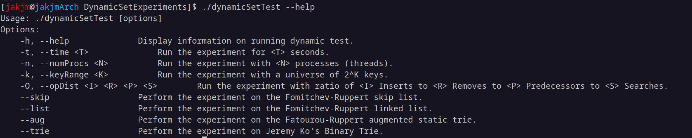
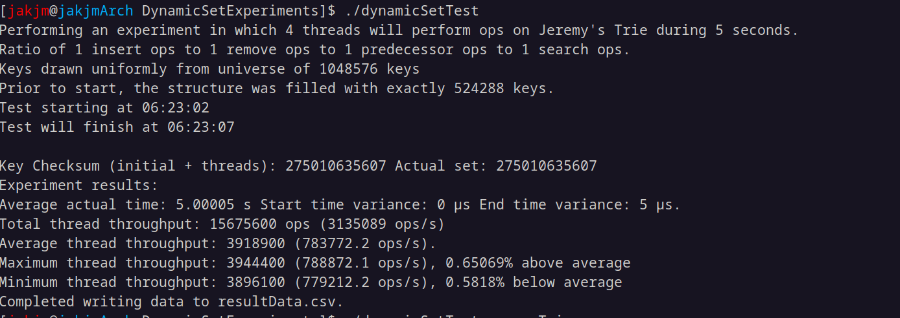
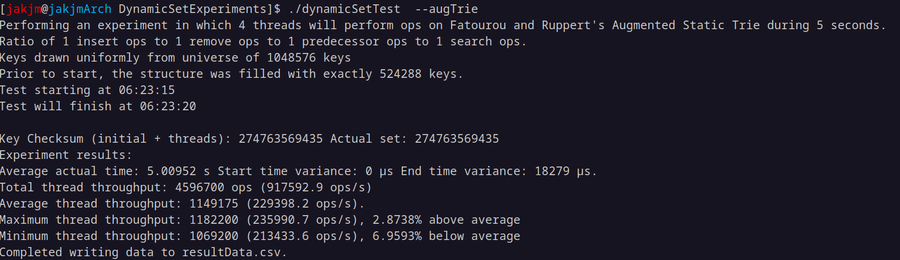

# Lock-Free Dynamic Set Implementations, Tests and Experiments

This repository contains implementations of the 
following published lock-free dynamic set data structures 
which support predecessor operations:
	- Ko's lock-free Binary Trie
	- Fomitchev and Ruppert's lock-free Linked List
	- Fomitchev and Ruppert's lock-free SkipList
	- Fatourou and Ruppert's wait-free Augmented Static Trie

They support insert, remove, search and predecessor operations.
Code for the implementations is in the DynamicSets 
folder.

This repository contains an implementation 
of a program which runs an experiment on one 
of these implementations, in which one or more processes
(threads) perform operations on the implementation 
during a fixed duration.
Settings for the experiment such as the data structure, duration, number of processes (threads), distribution of operations, 
key range (size of the universe of keys), can be provided as command line arguments to the program.
Statistics about the results of the experiment (such as the total number of operations that the processes performed)
are stored in an output file called resultsData.csv.

This program was used to perform experiments for my master's report at the University of Toronto.

The program is meant to be run on Linux or Unix-like machines with 
make, the GNU C++ compiler and posix-threads support.
You will need make and g++ installed on your system 
in order to compile the program using the Makefile.

Adapting the program to run on Windows or other operating systems 
is feasible but outside the scope of this project.

# Compiling the experimental program
To compile the program, use the following command in the folder containing the repository:
	
		make

# Running the experimental program
To run the program, use the following command:

		./dynamicSetTest

By default, the program will perform an experiment where 4 processes (threads) 
perform an equal distribution of operations (equal chance of insert, remove, 
search and predecessor) on Ko's lock-free Binary Trie.
By default, the data structure will store a subset of a universe containing 2^20 
keys and the experiment will last 5 seconds.

To see the available options for the experiment, use the following command:

		./dynamicSetTest --help

The output should appear like this:

Suppose we want to run a test in which 64 processes perform an update heavy distribution of operation during 10 seconds on
Fatourou and Ruppert's augmented static trie, with a universe containing 2^16 (65536) keys.
The following command can be used:

		./dynamicSetTest --augTrie -n 64 -t 10 -O 9 9 1 1 -k 16

In the experiment run by that command, there will be approximately 9 inserts and 9 removes performed for every 1 search and 1 predecessor operation.
In particular, every time a process will perform an operation on the augmented static trie, 
it will randomly choose to perform an insert with a 45% chance, a remove with a 45% chance, a search with a 5% chance and a predecessor operation
with a 5% chance.

Here are some examples of running experiments:

# Additional Notes

The repository contains the source code of Microsoft's mimalloc memory allocator,
which was used when performing the experiments.
If you wish to run an experiment with their memory allocation algorithm in use, 
first compile their project using the two following commands in the mimalloc-2.1.7 folder:

		cmake .
		make

Then, before running the dynamicSetTest program, use the following command:

		export LD_PRLEOAD=mimalloc-2.1.7/libmimalloc.so

This temporarily sets an environment variable in your current terminal instance.
While the environment variable is set, all programs that you run from your terminal 
will use mimalloc to allocate and reclaim memory.
This will only last in the current terminal instance; the effects will not 
persist if you close the terminal and open a new one.

When performing experiments, we pinned processes(threads) to certain hardware threads on the CPUs of the system
system. The following command allows you to pin processes(threads) running in a program to the first 4 hardware threads:

		taskset -c 0-3 [program]

For example we could run dynamicSetTest with taskset like so:

		taskset -c 0-3 ./dynamicSetTest 

Whereas, to pin to the first 4 even hardware threads, the following command could be used:

		taskset -c 0,2,4,6 ./dynamicSetTest
